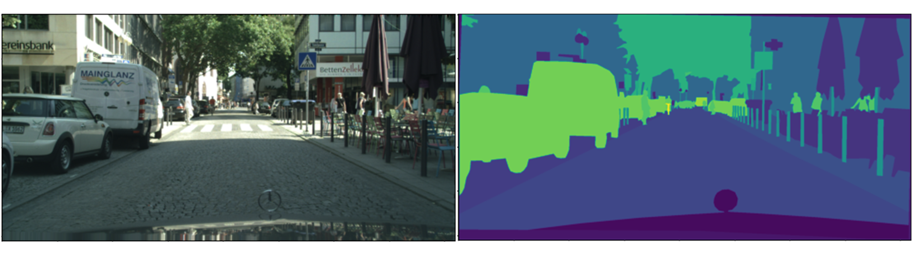

## About
This repository contains code used to train U-Net on a multi-class segmentation dataset. The code has been written in python. Inside the scripts folder, you can find all the different python files used to train, evaluate and prepare the data. The dataset that was used is the [cityscapes dataset](https://www.cityscapes-dataset.com/). More about the dataset is discussed in the consecutive sections. If you want to know how to perform image segmentation tasks in PyTorch, then visit my [text-based tutorial](https://medium.com/@mhamdaan/multi-class-semantic-segmentation-with-u-net-pytorch-ee81a66bba89) on medium. 



### Dependencies
| Sl. no. | Dependency | Install | 
| --- | --- | --- |
| 1. | [PyTorch](https://pytorch.org/) | Head on to PyTorch's official website and choose your OS, cuda version and other specifications and install. | 
| 2. | [torchvision](https://pytorch.org/vision/stable/index.html) | ```pip install torchvision``` |
| 3. | [Pillow](https://pillow.readthedocs.io/en/stable/) | ```python3 -m pip install --upgrade Pillow``` |
| 4. | [NumPy](https://numpy.org/) | ```pip install numpy``` | 
| 5. | [CityscapesScripts](https://github.com/mcordts/cityscapesScripts) | ```python -m pip install cityscapesscripts``` |

There are some other libraries that were also used such as Matplotlib (for visualization) and TQDM (to show the progress bar), but because they were only supplementary, I did not include them in the table above. 

### Dataset
abc
